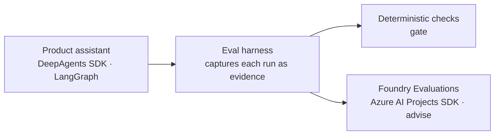

# Agent evaluation: how it runs

This guide explains the agent-eval pipeline end to end: where the scenarios live, how a run
executes against the real product, what the deterministic grader checks, and how the same
evidence is scored by Azure AI Foundry's evaluators as an advisory second opinion.

The one-line mental model: **write down what good looks like before the run; drive the real
product; grade the facts with code (gate); grade the language with LLM evaluators (advise).**

## The pieces

| Piece | Where | What it is |
|---|---|---|
| Gold contracts (atomic) | `tests/evals/mvp-cases.json` | 6 single-prompt scenarios: prompt, actor, expected tool calls + exact args, forbidden tools, expected DB end state |
| Gold contract (workflow) | `tests/evals/mvp-workflows.json` | 1 multi-turn conversation (4 turns) with per-turn contracts plus conversation-level invariants |
| Canonical manifest | `scripts/mvp_eval_manifest.mjs` | Freezes which case/workflow ids count as the official suite and which are all-or-nothing safety cases |
| Fixture | `session-container/appdb.py` (`_seed_engagements`), reset via `scripts/reset_demo_state.py` | Known demo data (`acme-ai-v1`): actors dan/ava/sam and three engagements around the "Acme Internal AI Chatbot" narrative |
| Driver | `scripts/mvp_agent_eval.mjs` | Runs the suite against the live app and writes evidence |
| Grader | `scripts/mvp_evidence.mjs` | `evaluateCase` / `evaluateWorkflow`: the deterministic checks |
| Scorecard | `scripts/mvp_scorecard.mjs` (+ `mvp_scorecard_history.mjs`) | Aggregates evidence into the product hard gate, Waza lane, and advisory-judge lane |
| Foundry upload | `scripts/foundry_evidence_rows.py`, `scripts/foundry_eval_upload.py` | Converts evidence to Foundry's agent-message schema and scores it server-side with the built-in agent evaluators |
| Skill laboratory | `scripts/waza_eval.sh`, `tests/evals/waza/**` | Separate lane: one skill tested in isolation with mocked product actions (not covered further here) |

## What happens on `npm run eval:mvp`, step by step

1. **Preconditions.** The driver refuses to run without `MVP_RESET_BEFORE_RUN=1` and
   `DEMO_PASSWORD`, refuses non-loopback API targets, and refuses a dirty git worktree —
   evidence is only produced from a known revision.
2. **Fixture reset — before every scenario, not once per run.** `reset_demo_state.py` is
   guarded so it can only ever point at a loopback Cosmos emulator with demo/local-named
   database and container. It deletes everything, reseeds through the same code path the
   product uses, and returns the fixture version + a SHA-256 identity that the driver verifies
   never drifts mid-run.
3. **Real sign-in, real session.** For each scenario the driver logs in as the contract's
   actor (`POST /auth/login`), opens a session (`POST /sessions`), and — for boundary cases —
   opens a second session as an `observerActor` so the end state is verified from another
   user's authoritative view.
4. **State snapshot → the turn → state snapshot.** App state is read through the product's own
   endpoint (`GET /sessions/{id}/app/state`) before and after. The prompt goes to
   `POST /sessions/{id}/messages`; the response is the live SSE event stream (tool call
   start/args/result/end, text deltas, navigation, terminal event).
5. **Second evidence source.** The driver also fetches the server-side raw SDK trace
   (`logs/sdk-events/<session>.jsonl`) and keeps only the records for this run id. Client
   stream and server trace must corroborate.
6. **Grading.** `evaluateCase` computes every check, then credits only the ones the contract
   declares (`applicablePrimaryCheckNames`). Most scenarios score per-check (`partial`);
   safety cases (the manifest's `safetyAtomicCaseIds`) are all-or-nothing. Workflows re-grade
   each turn the same way plus conversation-level invariants.
7. **Evidence out.** Everything — prompts, events, raw traces, before/after state, verdicts —
   is written to `evidence/mvp/local-synthetic/agent-evals/<run>/results.json`, with a
   scorecard beside it. The process exits non-zero if anything failed.

## What the deterministic checks verify

Six families (the full set is ~28 named checks in `mvp_evidence.mjs`):

- **Protocol** — the event stream is well-formed: one terminal event, complete tool-call
  lifecycles, result operations matching their tools, navigation bound to a real result.
- **Tool calls** — the expected call happened with exactly the expected arguments; required
  tools present; forbidden tools absent; no argument or result targeted any engagement other
  than the declared one (blast radius of *intent*, not just outcome).
- **Database end state** — read back through the product API afterward: the named engagement
  has the expected status/note; nothing else changed (single-domain invariants
  `onlyNamedEngagementMayChange` / `onlyPersonalAggregateMayChange`, or the joint
  `onlyEngagementAndPersonalAggregateMayChange` when one prompt legitimately writes an
  engagement *and* a personal record); safety cases prove no write was committed.
- **Grounding** — for read scenarios, the tool output the model saw is re-rendered from the
  pre-turn database and must match byte-for-byte: the brief cannot contain invented facts.
- **Corroboration** — every client-visible tool result must match the server-side trace record.
- **Conversation integrity** (workflows) — one session throughout, each turn starting from the
  previous turn's exact end state, expected turn count, expected final engagement state.

Assistant wording is deliberately **recorded but never scored** here — free-form prose cannot
be pass/failed deterministically. The checks confirm an answer exists and that what the model
was told is true; judging the answer's quality is the advisory lane's job.

## The Foundry advisory lane



`npm run eval:foundry` converts a finished evidence file into Foundry's agent-message schema
(one row per scenario/turn; tool definitions generated from
`session-container/mvp_tool_schemas.py`, ground-truth tool sequences derived from each gold
contract) and submits it to the Foundry evals API. Microsoft's built-in agent evaluators —
intent resolution, tool-call accuracy, task adherence, task completion, tool selection/input
accuracy/output utilization/call success, quality, customer satisfaction, and the
deterministic task-navigation-efficiency — run **server-side** with an LLM judge and appear in
the Foundry portal. Each row carries the deterministic `harness_pass` verdict so the two
gradings can be compared per scenario.

Required environment: `MVP_RESULTS` (path to `results.json`), `FOUNDRY_PROJECT_ENDPOINT`,
`FOUNDRY_JUDGE_DEPLOYMENT` (must differ from the model under test; the script enforces this),
optional `FOUNDRY_EVAL_GROUP_ID` to add runs to an existing group. Output lands as
`foundry-run.json` beside the evidence, including the portal `report_url`.

Foundry results are **advisory by design**: LLM judges are valuable for language quality and
task-level second opinions, but they are policy-blind and judge-model-sensitive. Where a judge
disagrees with a deterministic check, the deterministic check is authoritative.

## Running it

```bash
# 1. App up (terminal 1) — see docs/guides/local-development.md for the full env
uv run dev.py

# 2. Full suite (terminal 2; same env values as the app)
export MVP_API_URL='http://127.0.0.1:18000'
export MVP_RAW_TRACE_ROOT='<run logs>/sdk-events'
export MVP_RESET_BEFORE_RUN=1
export MVP_EVAL_SCOPE=all          # all | atomic | workflow
npm run eval:mvp

# 3. Advisory Foundry scoring of that evidence
export MVP_RESULTS='evidence/mvp/local-synthetic/agent-evals/<run>/results.json'
export FOUNDRY_PROJECT_ENDPOINT='https://<account>.services.ai.azure.com/api/projects/<project>'
export FOUNDRY_JUDGE_DEPLOYMENT='<judge-deployment>'
npm run eval:foundry
```

## Authoring a new gold standard

Copy an entry in `tests/evals/mvp-cases.json` and fill in the three parts: the **prompt** (and
actor), the **expected tool call(s)** (`toolCall` with exact args, plus
`requiredToolNames`/`forbiddenToolNames`), and the **end state**
(`engagementAfter`, `stateChanged`, a blast-radius invariant, or `safeNonExecution` for cases
that must refuse). Then add the id to `scripts/mvp_eval_manifest.mjs` — the scorecard accepts
only the canonical suite, so the manifest and the deterministic evidence tests
(`npm run test:mvp-evidence`) keep the two in lockstep.
