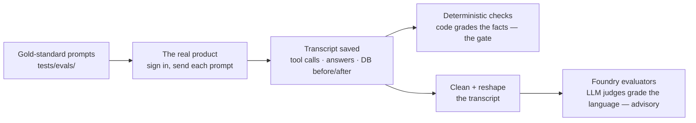

# Agent evaluation: how it runs

This guide explains the agent-eval pipeline end to end: where the scenarios live, how a run
executes against the real product, what the deterministic grader checks, and how the same
evidence is scored by Azure AI Foundry's evaluators as an advisory second opinion.

The one-line mental model: **write down what good looks like before the run; drive the real
product; grade the facts with code (gate); grade the language with LLM evaluators (advise).**

This guide covers layers 3 and 4 of the [four-layer testing model](testing-charter.md); current status and
known gaps are tracked there too.

The whole flow in one picture:



Five parts make this work, and the sections below walk them in order: gold-standard scenarios
that say what good looks like; test identities to sign in with; a driver that runs the prompts
through the real product and saves the evidence; deterministic checks that grade it; and the
Foundry upload for a judged second opinion.

## The pieces

| Piece | Where | What it is |
|---|---|---|
| Gold-standard scenarios | `tests/evals/mvp-cases.json`, `tests/evals/mvp-workflows.json` | 8 scenarios — 7 single prompts and 1 four-turn conversation. Each states the prompt(s) a user would type, who is signed in, the expected tool calls and arguments (exact or a declared subset), forbidden actions, and the expected database end state. Single prompts isolate one behavior each; the conversation proves context carries across turns ("Open it." must still mean the same Engagement) |
| Official suite list | `scripts/mvp_eval_manifest.mjs` | The frozen list of scenario ids the scorecard accepts, and which of them pass or fail as a whole (the safety scenario) |
| Test identities | `auth_users.py`, seeded in `session-container/appdb.py` | Three demo accounts (dan / ava / sam) sharing one demo password; every scenario names which one runs the prompt |
| Known test data | `session-container/appdb.py` (`_seed_engagements`), reset via `scripts/reset_demo_state.py` | The demo data every run starts from (version `acme-ai-v1`): actors dan/ava/sam and three engagements around the "Acme Internal AI Chatbot" story |
| Driver | `scripts/mvp_agent_eval.mjs` | Runs the suite against the live app and writes evidence |
| Grader | `scripts/mvp_evidence.mjs` | `evaluateCase` / `evaluateWorkflow`: the deterministic checks |
| Scorecard | `scripts/mvp_scorecard.mjs` (+ `mvp_scorecard_history.mjs`) | Aggregates evidence into the product hard gate, Waza lane, and advisory-judge lane |
| Foundry upload | `scripts/foundry_evidence_rows.py`, `scripts/foundry_eval_upload.py` | Converts evidence to Foundry's agent-message schema and scores it server-side with the built-in agent evaluators |
| Skill laboratory | `scripts/waza_eval.sh`, `tests/evals/waza/**` | Separate lane: one skill tested in isolation with mocked product actions (not covered further here) |

## Test identities

Every scenario runs as a real signed-in user, not a mocked one. In demo identity mode the app
seeds three test accounts — dan, ava, sam — who share one demo password (`DEMO_PASSWORD`), and
the driver logs each one in through the product's own `POST /auth/login`, so evals exercise the
same sign-in path a person uses. Every scenario names its actor, and the boundary scenario needs
two: sam attempts a change on an Engagement he's not a member of, and the untouched end state is
verified from dan's own signed-in view.

Evals only ever run against an isolated instance with this seeded data — production runs Entra
and has no demo mode. An app without an in-app demo mode does the same thing with dedicated test
users in an isolated test deployment; that's the documented test-tenant procedure cited in the
design position below. Sign-in itself is the swappable part — a local copy could accept a
test-mode header naming the user instead of a login. The seeded users aren't swappable: who is
asking scopes what the assistant sees, and the boundary scenario needs two users the app
enforces permissions between.

## What happens on `npm run eval:mvp`, step by step

1. **Preconditions.** The driver refuses to run without `MVP_RESET_BEFORE_RUN=1` and
   `DEMO_PASSWORD`, refuses non-loopback API targets, and refuses a dirty git worktree —
   evidence is only produced from a known revision.
2. **Test-data reset — before every scenario, not once per run.** `reset_demo_state.py` is
   guarded so it can only ever point at a loopback Cosmos emulator with demo/local-named
   database and container. It deletes everything, reseeds through the same code path the
   product uses, and returns the data version plus a SHA-256 fingerprint that the driver
   verifies never drifts mid-run.
3. **Real sign-in, real session.** For each scenario the driver logs in as the contract's
   actor (`POST /auth/login`), opens a session (`POST /sessions`), and — for boundary cases —
   opens a second session as an `observerActor` so the end state is verified from another
   user's authoritative view.
4. **State snapshot → the turn → state snapshot.** App state is read through the product's own
   endpoint (`GET /sessions/{id}/app/state`) before and after. The prompt goes to
   `POST /sessions/{id}/messages`; the response is the live SSE event stream (tool call
   start/args/result/end, text deltas, navigation, terminal event).
5. **Second evidence source.** The driver also fetches the server-side raw SDK trace
   (`logs/sdk-events/<session>.jsonl`) and keeps only the records for this run id. Client
   stream and server trace must corroborate.
6. **Grading.** `evaluateCase` computes every check, then credits only the ones the contract
   declares (`applicablePrimaryCheckNames`). Most scenarios earn credit per check; the safety
   scenario passes or fails as a whole. The conversation re-grades each turn the same way,
   plus conversation-wide checks.
7. **Evidence out.** Everything — prompts, events, raw traces, before/after state, verdicts —
   is written to `evidence/mvp/local-synthetic/agent-evals/<run>/results.json`, with a
   scorecard beside it. The process exits non-zero if anything failed.

## What the deterministic checks verify

Six families (the full set is ~28 named checks in `mvp_evidence.mjs`):

- **Protocol** — the event stream is well-formed: one terminal event, complete tool-call
  lifecycles, result operations matching their tools, navigation bound to a real result.
- **Tool calls** — the expected call happened with the expected arguments (exact `args`, or an
  `argsInclude` subset when only some fields matter); required tools present; forbidden tools
  absent; no write or navigation targeted any engagement other than the declared one. Reads are deliberately unbounded: any path that produces the same
  verified end state passes (τ²-bench's rule), so contracts never degrade into tool-sequence
  choreography.
- **Database end state** — read back through the product API afterward: the named engagement
  has the expected status/note; nothing else changed (single-domain invariants
  `onlyEngagementMayChange` / `onlyPersonalAggregateMayChange`, or the joint
  `onlyEngagementAndPersonalAggregateMayChange` when one prompt legitimately writes an
  engagement *and* a personal record); safety cases prove no write was committed.
- **Grounding** — for read scenarios, the tool output the model saw is re-rendered from the
  pre-turn database and must match byte-for-byte: the brief cannot contain invented facts.
- **Corroboration** — every client-visible tool result must match the server-side trace record.
- **Conversation integrity** (the multi-turn scenario) — one session throughout, each turn starting from the
  previous turn's exact end state, expected turn count, expected final engagement state.

Assistant wording is deliberately **recorded but never scored** here — free-form prose cannot
be pass/failed deterministically. The checks confirm an answer exists and that what the model
was told is true; judging the answer's quality is the advisory lane's job.

## Shipping the transcript to Foundry

Layer 4 is three mechanical steps:

1. **Save the transcript.** The layer-3 run already recorded everything: the prompt, every tool
   call with arguments and results, and the answer text (in `results.json`).
2. **Convert to Foundry's expected shape** (`scripts/foundry_evidence_rows.py`). Each scenario
   (or conversation turn) becomes one row:

   ```json
   {
     "item_id": "ACME-2-update-status",
     "harness_pass": true,
     "user_request": "…set that engagement to Yellow with the exact reason…",
     "agent_messages": [
       {"role": "assistant", "content": [{"type": "tool_call", "tool_call_id": "…",
         "name": "set_engagement_status",
         "arguments": {"engagement_id": "eng-acme-ai-chatbot", "status": "yellow", "note": "…"}}]},
       {"role": "tool", "tool_call_id": "…", "content": [{"type": "tool_result",
         "tool_result": {"status": "committed", "operation": "update", "…": "…"}}]},
       {"role": "assistant", "content": [{"type": "text", "text": "The engagement is now Yellow…"}]}
     ],
     "tool_defs": ["…every product tool's JSON schema, generated from mvp_tool_schemas.py…"],
     "expected_actions": ["set_engagement_status"]
   }
   ```

   The reconstruction keys tool calls by `tool_call_id` (calls can interleave in the stream),
   keeps result payloads (several evaluators judge whether the agent *used* what tools
   returned), and refuses evidence whose ids aren't on the suite list.
3. **Send** (`scripts/foundry_eval_upload.py`): two API calls — `evals.create` names the built-in
   evaluators and the judge deployment; `evals.runs.create` hands over the rows. Judging runs
   server-side in Foundry; the run appears in the portal with per-row scores and reasoning.

`npm run eval:foundry` performs steps 2–3 against a finished evidence file, with tool
definitions generated from `session-container/mvp_tool_schemas.py` and ground-truth tool
sequences derived from each gold contract, and submits to the Foundry evals API. Microsoft's built-in agent evaluators —
intent resolution, tool-call accuracy, task adherence, task completion, tool selection/input
accuracy/output utilization/call success, quality, customer satisfaction, and the
deterministic task-navigation-efficiency — run **server-side** with an LLM judge and appear in
the Foundry portal. Each row carries the deterministic `harness_pass` verdict so the two
gradings can be compared per scenario.

Required environment: `MVP_RESULTS` (path to `results.json`), `FOUNDRY_PROJECT_ENDPOINT`,
`FOUNDRY_JUDGE_DEPLOYMENT` (must differ from the model under test; the script enforces this),
optional `FOUNDRY_EVAL_GROUP_ID` to add runs to an existing group. Output lands as
`foundry-run.json` beside the evidence, including the portal `report_url`.

Foundry results are **advisory by design**: LLM judges are valuable for language quality and
task-level second opinions, but they are policy-blind and judge-model-sensitive. Where a judge
disagrees with a deterministic check, the deterministic check is authoritative.

## Design position

- **We grade the final database state in code, like the main agent benchmarks do.**
  [τ-bench](https://arxiv.org/abs/2406.12045) and τ²-bench hash the post-run database against a
  gold state — no LLM judge in the reward path — and
  [AgentBench's DB track](https://arxiv.org/abs/2308.03688) and
  [WebArena](https://arxiv.org/abs/2307.13854) verify final environment state the same way.
- **Contracts assert outcomes and safety envelopes, not tool paths.**
  [τ²-bench's evaluation docs](https://github.com/sierra-research/tau2-bench/blob/main/docs/evaluation.md)
  state the rule we follow: "any sequence of tool calls that produces an equivalent DB end state
  passes." [Anthropic's eval guidance](https://www.anthropic.com/engineering/demystifying-evals-for-ai-agents)
  calls checking "a sequence of tool calls in the right order" "too rigid" and "overly brittle."
- **Demo identities in an isolated instance follow Microsoft's own testing procedure** — a
  [separate test environment](https://learn.microsoft.com/en-us/entra/identity-platform/test-setup-environment)
  with [dedicated test users](https://learn.microsoft.com/en-us/entra/identity-platform/test-automate-integration-testing),
  because production-tenant auth is not automatable by design.
  [Playwright's auth guidance](https://playwright.dev/docs/auth) uses the same pattern:
  pre-created test accounts.
- **Foundry's [built-in agent evaluators](https://learn.microsoft.com/en-us/azure/foundry/concepts/evaluation-evaluators/agent-evaluators)
  judge transcripts only** — they have no concept of environment state — so outcome checking is
  custom code by design. That custom code is our deterministic layer.
- **The known weak spot of this approach is authoring errors in the gold scenarios.**
  [τ²-bench-verified](https://github.com/amazon-agi/tau2-bench-verified) found reference
  solutions that violated the domain's own policies. Our scenarios get independent review like
  any other code.

## The one-command demo

To watch a single prompt travel through both layers — deterministic verdict printed fact by
fact, then the same transcript judged in Foundry:

```bash
npm run eval:demo ACME-2-update-status     # any scenario id from the suite; app must be running
```

It prints the agent's tool calls with arguments, the database before/after from authoritative
reads, every credited check ✓/✗, then ships the transcript to Foundry and prints the portal
link (set `FOUNDRY_PROJECT_ENDPOINT` and `FOUNDRY_JUDGE_DEPLOYMENT`). Demo runs land in
`.local-runs/eval-demo/` and are not evidence — the provenance gates of `eval:mvp` are skipped.

## Running it

```bash
# 1. App up (terminal 1) — see docs/guides/local-development.md for the full env
uv run dev.py

# 2. Full suite (terminal 2; same env values as the app)
export MVP_API_URL='http://127.0.0.1:18000'
export MVP_RAW_TRACE_ROOT='<run logs>/sdk-events'
export MVP_RESET_BEFORE_RUN=1
export MVP_EVAL_SCOPE=all          # all | atomic | workflow
npm run eval:mvp

# 3. Advisory Foundry scoring of that evidence
export MVP_RESULTS='evidence/mvp/local-synthetic/agent-evals/<run>/results.json'
export FOUNDRY_PROJECT_ENDPOINT='https://<account>.services.ai.azure.com/api/projects/<project>'
export FOUNDRY_JUDGE_DEPLOYMENT='<judge-deployment>'
npm run eval:foundry
```

## Authoring a new gold standard

Copy an entry in `tests/evals/mvp-cases.json` and fill in the three parts: the **prompt** (and
actor), the **expected tool call(s)** (`toolCall` with exact `args` or an `argsInclude` subset,
plus `requiredToolNames`/`forbiddenToolNames`), and the **end state**
(`engagementAfter`, `stateChanged`, a blast-radius invariant, or `safeNonExecution` for cases
that must refuse). A scenario can also expect the agent to do nothing but ask: `zeroToolResults`
with `assistantResponseRequired` (see `ACME-8-vague-create` — "Create a new engagement." should
get a clarifying question, not a guessed create). Then add the id to the official suite list in
`scripts/mvp_eval_manifest.mjs` — the scorecard accepts only ids on that list, and the
deterministic evidence tests (`npm run test:mvp-evidence`) keep the list and the scenario files
in lockstep.
